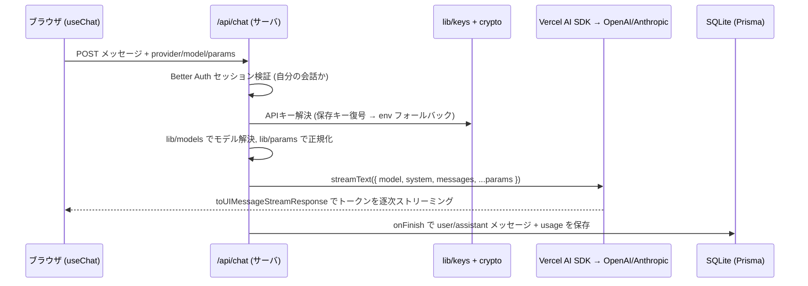

# 設計書: API経由でLLMを呼び出せるプロンプト検証チャット（PlainChat）

最終更新: 2026-06-06

## 1. 目的・背景

ChatGPT / Claude などの「チャット製品」で使えるモデルと、**API経由で使えるモデル**は、厳密には挙動・パラメータが異なる。プロダクトに組み込むプロンプトを設計する担当者（**多くは非エンジニア**）が、実際にAPIで利用するモデルを使ってプロンプトを検証できる環境が必要となる。

本ツール `PlainChat` は、その用途に絞った「ChatGPTのチャット機能だけのクローン」である。

### 要件

- シンプルな日本語チャットUI（ChatGPTライク）
- プロバイダー / モデルをプルダウンで切り替え（**OpenAI** と **Anthropic**）
- プロンプト検証用の調整機能: **システムプロンプト入力** + **パラメータ調整**（temperature / max tokens / top-p など）
- 最低限の認証（**ユーザーごとのアカウント**）
- チャット履歴を保存（**ユーザーごとに分離**）
- **ローカル実行**（Vercel等のホスティング前提にしない）
- TypeScript で実装
- このリポジトリの **1ディレクトリ配下**（`PlainChat/`）に自己完結で配置
- 各プロバイダーのAPIキーを**UIから設定して記憶**する

---

## 2. 重要な設計ポイント: モデルごとのパラメータ差異

本ツールの肝は「APIの実挙動を忠実に再現すること」。プロバイダー / モデルで使えるパラメータが異なるため、**モデル能力レジストリ（capability registry）** を中核に置き、UIと送信パラメータの両方をそれで駆動する。

| モデル系 | temperature / top_p / top_k | thinking / effort | 備考 |
|---|---|---|---|
| OpenAI (GPT-4o, GPT-4.1 等) | ✅ 使用可 | — | 従来通り |
| Anthropic Claude Opus 4.8 / 4.7 | ❌ **送ると 400 エラー** | `thinking: adaptive` + `effort: low/medium/high/xhigh/max` | sampling 系は撤廃済み |
| Anthropic Claude Sonnet 4.6 / Haiku 4.5 | ✅ temperature 等は可（temperature か top_p の一方） | adaptive thinking 可（effort は Haiku 不可） | — |

→ レジストリで「このモデルはどのコントロールを表示し、どのパラメータを送ってよいか」を定義し、**非対応パラメータは UI に出さず・送らない**。これにより非エンジニアが触って API エラーになるのを防ぎ、検証の忠実性も担保する。

---

## 3. 技術選定（理由付き）

| 領域 | 採用 | 理由（要約） |
|---|---|---|
| アプリ基盤 | **Next.js (App Router) + TypeScript** | フロント + バックエンドを 1 コードベース・1 プロセスで実現。APIキーをサーバ側に隠せる。`next dev` / `next start` でローカル実行でき Vercel 非依存。 |
| UI | **React + Tailwind CSS + shadcn/ui** | ChatGPT ライクな UI を最小コストで。日本語表示・アクセシビリティ良好。UI 文言は日本語でハードコード。 |
| LLM アクセス | **Vercel AI SDK (`ai` + `@ai-sdk/openai` + `@ai-sdk/anthropic`)** | **本番プロダクトが同 SDK を採用**しているため、検証ツールも寄せることで挙動・パラメータの扱いが本番と一致する。`useChat` でストリーミング UI も簡潔化。 |
| 永続化 | **SQLite + Prisma ORM** | ローカル単一マシン用途に最適。単一ファイル DB で外部サービス不要。Prisma Studio で履歴を GUI 閲覧可。 |
| 認証 | **Better Auth（email & password）** | TypeScript ネイティブ。ユーザーごとアカウント + 履歴分離をメール/パスワードで標準サポート。Prisma 連携。 |
| 起動 | **Node ローカル実行 + `.env.local`**（任意で Docker Compose） | 「ローカル実行」要件に合致。DB は SQLite ファイルなので DB コンテナ不要。 |

詳細な意思決定（代替案・トレードオフ）は [`ADR.md`](./ADR.md) を参照。

---

## 4. ディレクトリ構成（`PlainChat/` 配下に自己完結）

```
PlainChat/
  package.json, tsconfig.json, next.config.ts, tailwind.config.ts
  .env.example                      # BETTER_AUTH_SECRET / BETTER_AUTH_URL / ENCRYPTION_KEY / DATABASE_URL
                                    #  （OPENAI/ANTHROPIC_API_KEY は任意のフォールバック）
  prisma/
    schema.prisma                   # Better Auth(user/session/account/verification) + Conversation/Message/ProviderKey
    seed.ts                         # 初期ユーザー作成
  src/
    app/
      layout.tsx, globals.css
      (auth)/login/page.tsx         # ログイン画面（日本語）
      page.tsx                      # チャット画面（履歴サイドバー + 会話ペイン + 設定パネル）
      settings/page.tsx             # APIキー設定画面（プロバイダーごと、設定状態 + マスク表示）
      api/
        auth/[...all]/route.ts      # Better Auth ハンドラ（toNextJsHandler）
        chat/route.ts               # POST: streamText → toUIMessageStreamResponse、onFinish で履歴保存
        keys/route.ts               # GET 状態 / PUT 保存(暗号化) / DELETE（APIキー、ユーザー単位）
        conversations/route.ts      # 会話一覧 / 作成 / 削除（ユーザー単位）
        conversations/[id]/route.ts # 1 会話のメッセージ取得
    lib/
      models.ts                     # ★モデル能力レジストリ（中核）。AI SDK の model 解決もここで
      params.ts                     # レジストリに基づき AI SDK へ渡すパラメータを正規化
      crypto.ts                     # APIキーの AES-256-GCM 暗号化/復号（node:crypto）
      keys.ts                       # キー解決（ユーザー保存キー → env フォールバック）
      db.ts                         # Prisma クライアント
      auth.ts                       # Better Auth サーバ設定（prismaAdapter）
      auth-client.ts                # createAuthClient（クライアント）
    components/
      ChatPane.tsx, MessageList.tsx, MessageInput.tsx  # useChat(@ai-sdk/react) で構築
      ModelSelector.tsx             # プロバイダー/モデルのプルダウン
      SettingsPanel.tsx             # システムプロンプト + パラメータ（レジストリ駆動で表示制御）
      ApiKeySettings.tsx            # APIキー入力フォーム（保存/削除、マスク表示）
      ConversationSidebar.tsx
  README.md                         # セットアップ・起動手順（日本語）
  docs/
    DESIGN.md                       # 本ファイル
    ADR.md                          # 主要な技術選定の判断記録（理由つき）
```

リポジトリルートの `.gitignore` に `PlainChat/node_modules/`、`PlainChat/.next/`、`PlainChat/.env.local`、`PlainChat/prisma/dev.db*` を追記する。

---

## 5. データモデル（Prisma schema 概略）

- **Better Auth 標準テーブル**: `user`(id/email/name/...) / `session` / `account`（パスワードハッシュ含む） / `verification`
  ※ Better Auth CLI で生成
- **Conversation**: `id`, `userId`(→user.id), `title`, `provider`, `model`, `systemPrompt`, `params`(JSON), `createdAt`, `updatedAt`
- **Message**: `id`, `conversationId`(FK), `role`('user'|'assistant'|'system'), `content`, `model`(送信時のモデル), `usage`(JSON: tokens 等), `createdAt`
- **ProviderKey**: `id`, `userId`(→user.id), `provider`('openai'|'anthropic'), `encryptedKey`(AES-256-GCM), `last4`(マスク表示用), `updatedAt`
  （`userId` + `provider` でユニーク）

履歴はユーザー単位。会話ごとに使用モデル・システムプロンプト・パラメータを保存し、後から「どの設定で何を試したか」を再現できる（プロンプト検証用途に重要）。

---

## 6. モデル能力レジストリ（`lib/models.ts`）

各エントリ:

```ts
{
  provider: 'openai' | 'anthropic',
  id: string,              // 例: 'gpt-4o', 'claude-opus-4-8'
  label: string,           // プルダウン表示
  supports: {
    temperature: boolean,  // false なら UI 非表示 & 未送信
    topP: boolean,
    maxTokens: boolean,
    thinkingEffort: boolean // Anthropic 4.x 系の effort 切替を出すか
  },
  defaults: { ... }
}
```

- `ModelSelector` がプルダウン候補を生成
- `SettingsPanel` が「そのモデルで有効なコントロールだけ」を表示
- `lib/params.ts` が `streamText` へ渡す前に**非対応パラメータを除去/変換**
  （例: Opus 4.8/4.7 へ temperature を送らず、`providerOptions.anthropic.thinking` に変換）

採用モデル例（初期）:
- OpenAI: `gpt-4o`, `gpt-4.1`（必要に応じ追加）
- Anthropic: `claude-opus-4-8`, `claude-sonnet-4-6`, `claude-haiku-4-5`

---

## 7. APIキー管理（UI 設定 + 永続化）

各プロバイダー（OpenAI / Anthropic）の API キーを **画面の UI から入力して保存**し、次回以降も **記憶** する。ユーザーごとのアカウント要件に合わせ、**キーはユーザー単位**で保持する。

- **保存先 / 暗号化**: SQLite の `ProviderKey` テーブルに保存。平文保存を避けるため、`ENCRYPTION_KEY`（`.env.local`）を使った **AES-256-GCM（`node:crypto`）で at rest 暗号化**。復号はサーバ側 Route Handler 内で LLM 呼び出し直前のみ。
- **UI**: 設定画面にプロバイダーごとの入力欄。**状態（設定済み/未設定）と下 4 桁マスク（例: `sk-...abcd`）のみ表示**し、生キーはクライアントに返さない。「保存」「削除」操作を提供。
- **エンドポイント**: `api/keys` — `GET`（各プロバイダーの設定有無 + マスク表示） / `PUT`（暗号化して保存・上書き） / `DELETE`（削除）。すべて自分のキーのみ操作可。
- **キー解決順**（`/api/chat` 内）: ユーザーの保存キー（復号）→ なければ `.env.local` のキー → どちらも無ければ「キー未設定」エラーを UI に表示。

---

## 8. リクエストフロー



1. ログイン（Better Auth / email & password）→ セッション Cookie
2. チャット画面でプロバイダー・モデル選択、システムプロンプト/パラメータ設定、メッセージ送信
3. `POST /api/chat`（サーバ側）で上記フローを実行
4. サイドバーから過去会話を選び再開・閲覧

API キーは常にサーバ側 Route Handler でのみ復号・使用し、生キーはブラウザに返さない（マスク表示のみ）。

---

## 9. 検証方法（実装後のエンドツーエンド確認）

1. `cd PlainChat && npm install`
2. `.env.local` に `BETTER_AUTH_SECRET`(ランダム文字列) / `BETTER_AUTH_URL="http://localhost:3000"` / `ENCRYPTION_KEY`(32 バイトのランダム鍵) / `DATABASE_URL="file:./dev.db"` を設定（API キーは UI から入れるので任意）
3. `npx prisma migrate dev` → `npx prisma db seed`（初期ユーザー作成）
4. `npm run dev` → `http://localhost:3000`
5. 動作確認チェックリスト:
   - 初期ユーザーでログインできる / 未ログインはチャットにアクセスできない
   - 設定画面で OpenAI / Anthropic の API キーを入力 → 保存できる。再読込しても「設定済み（下 4 桁マスク）」が保持され、生キーはレスポンスに含まれない。`ProviderKey` が暗号化保存されている（`prisma studio` で `encryptedKey` が平文でないこと）
   - キー未設定のプロバイダーを使うと「キー未設定」エラーが UI に出る
   - プルダウンで OpenAI と Anthropic のモデルを切り替えられる
   - **OpenAI モデル**: temperature/top-p/max tokens コントロールが表示され、応答がストリーミングで出る
   - **Anthropic Opus 4.8**: temperature 等が非表示になり、effort 切替が出る。送信しても API エラーにならない（非対応 param が除去されている）
   - システムプロンプトを設定 → 応答に反映される
   - 送信後にリロードしても会話と履歴が残る（`npx prisma studio` で確認）
   - 別ユーザーでログインすると相手の履歴が見えない（ユーザー分離）
6. （任意）`docker compose up` でワンコマンド起動できることを確認

---

## 10. スコープ外（初期リリースでは作らない）

- 画像/ファイル添付、関数呼び出し(tool use)、ストリーミング中断 UI
- 複数組織/ロール権限、OAuth ログイン、パスワードリセットメール
- クラウドデプロイ前提の構成（あくまでローカル実行優先）

これらは拡張余地として認識しておく。
